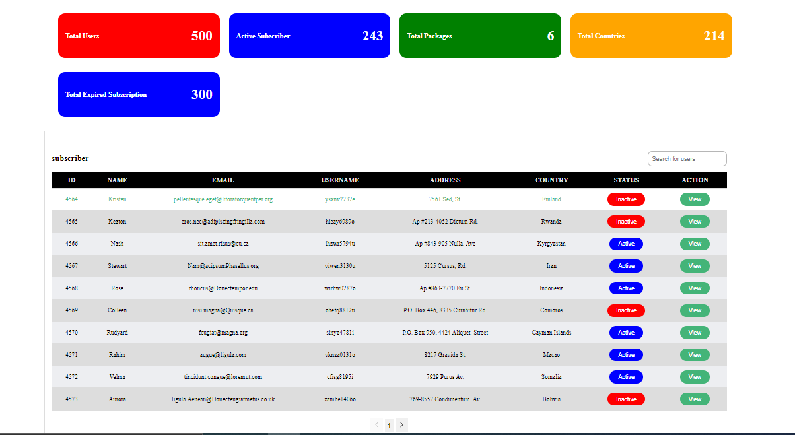
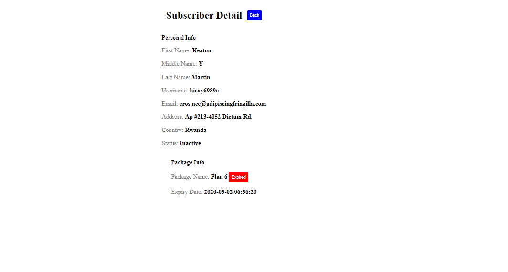

# Subscriber Dashboard


## Screenshots




## Technology

1. React Js
2. Typescript
3. Webpack 


## Run Locally

Clone the project

```bash
  git clone https://github.com/sarojdahal8848/subsciption-panel.git
```

Go to the project directory

```bash
  cd subscription-panel
```

Install dependencies

```bash
  npm install
```

Start the server

```bash
  npm start
```

## Author

- [Saroj Dahal](https://github.com/sarojdahal8848)
